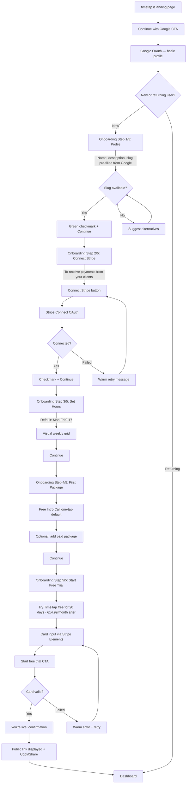
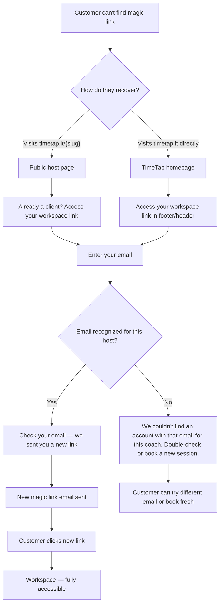

# UX Design Specification — TimeTap

**Author:** Luca
**Date:** 2026-02-12

---

## Executive Summary

### Project Vision

TimeTap is a credit-based booking system that replaces the fragmented stack of Calendly + Stripe + spreadsheets used by service providers selling session packages. The core UX proposition is a single integrated flow: hosts create packages, customers buy credits, customers book sessions — with a built-in conversion engine (free intro → upsell email → package purchase → ongoing bookings). The product serves two distinct user types through one mobile-first responsive web app at `timetap.it`.

### Target Users

**Hosts (Service Providers)**
- Initially life coaches; expanding to trainers, tutors, consultants
- Managing ~10-15 active clients, currently losing 3-5 hours/week to admin
- Check the app on their phone between sessions — need at-a-glance info
- Authenticated via Google OAuth (two-step: sign-in first, calendar permissions during onboarding)
- Moderate tech-savviness; familiar with tools like Calendly and Stripe

**Customers (Session Buyers)**
- Varying tech-savviness — must assume low comfort level
- Zero-friction access via magic links — no accounts, no passwords
- Discover hosts through shared links (Instagram bio, email, etc.)
- Interact primarily on mobile
- Mental model: "my relationship with my coach" — credits, sessions, schedule

### Key Design Challenges

1. **Two distinct mental models in one product.** Hosts think in business terms (clients, packages, revenue). Customers think in relationship terms (my coach, my credits, my next session). The UX must serve both without feeling bloated for either.

2. **Magic link re-access.** No-password access is frictionless on first use but creates "how do I get back in?" anxiety. The re-access flow must be obvious and forgiving.

3. **Mobile-first host dashboard.** Hosts check between sessions on their phones. Key information (today's schedule, new bookings, low-credit clients) must be scannable at a glance without feeling cramped.

4. **Booking slot selection on mobile.** Combining availability templates with real-time Google Calendar busy times on a small screen requires careful interaction design to avoid confusion and mis-taps.

5. **Two-step Google OAuth onboarding.** Sign-in and calendar permissions are separate moments — the transition must feel natural, not like a bait-and-switch.

### Design Opportunities

1. **The "between sessions" moment.** A smartly designed home screen showing contextual "right now" information (next session, new bookings, low-credit alerts) can make TimeTap feel indispensable during the host's most common usage window.

2. **Seamless free-to-paid conversion.** The free intro → upsell → purchase → magic link flow is the growth engine. If this transition feels effortless and natural rather than salesy, conversion rates could be exceptional.

3. **Progressive disclosure for customers.** Customers start as anonymous visitors (public page), then gain capabilities step by step (book free session → receive magic link → workspace with credits → re-purchase). Each step reveals only what's needed — never overwhelming.

### Color Palette

The complete, strict color system for TimeTap. No colors outside this palette are permitted in the UI.

**Primary (Brand)**

| Token | Hex | Usage |
|---|---|---|
| `primary-gradient` | `#4facfe → #00f2fe` | Primary buttons, hero accents, decorative elements |
| `primary` | `#4facfe` | Links, focused states, active indicators, icons |
| `primary-hover` | `#3d8de5` | Link/button hover states |
| `primary-light` | `#ebf5ff` | Selected/active backgrounds, subtle highlights |

**Neutrals (Slate scale)**

| Token | Hex | Usage |
|---|---|---|
| `text-primary` | `#1a202c` | Headings, high-emphasis text |
| `text-body` | `#2d3748` | Body text, default text |
| `text-secondary` | `#4a5568` | Secondary labels, descriptions |
| `text-muted` | `#718096` | Placeholder text, captions, timestamps |
| `text-disabled` | `#a0aec0` | Disabled text, inactive icons |
| `border` | `#cbd5e0` | Input borders, card borders |
| `divider` | `#e2e8f0` | Section dividers, separators |
| `bg-subtle` | `#edf2f7` | Page background, subtle surface contrast |
| `bg-page` | `#f7fafc` | Main page background |
| `surface` | `#ffffff` | Cards, modals, inputs, navigation |

**Semantic**

| Token | Hex | Usage |
|---|---|---|
| `success` | `#38a169` | Confirmations, completed states, credit available |
| `success-light` | `#f0fff4` | Success banners/backgrounds |
| `error` | `#e53e3e` | Errors, destructive actions, validation |
| `error-light` | `#fff5f5` | Error banners/backgrounds |
| `warning` | `#d69e2e` | Warnings, low-credit alerts |
| `warning-light` | `#fffff0` | Warning banners/backgrounds |

**Rules:** 20 colors total. Gradient used sparingly for brand moments and primary CTAs. `primary` solid is the workhorse for interactive elements. All text uses the slate scale — no pure black. Semantic colors only for their designated purpose.

### Design Language

- **Logo motif:** Calendar icon with dot-grid pattern + gradient underline — geometric, minimal
- **Overall feel:** Minimalist, professional but approachable, mobile-first
- **Logo files:** `logo/timetap_full_logo.svg` (wordmark), `logo/timetap_icon_only.svg` (icon)

## Core User Experience

### Defining Experience

**Host: "Set it and forget it"**
The host experience is defined by *absence of effort*. After a short onboarding, TimeTap runs in the background — clients find the host's page, buy packages, book sessions, and rebook when credits run low. The host's daily interaction is a quick glance at their schedule between sessions, not active management. The product's success is measured by how little admin time it demands.

**Customer: "Credits in, sessions booked"**
The customer experience is defined by *immediacy*. Open magic link, see credits, pick a slot, done. No learning curve, no account management, no friction. The workspace feels like a simple, personal portal to their coach — not a software product.

**The conversion bridge:**
The free session → upsell email → package purchase → first booked session flow is the critical path that connects both experiences. It must feel like a natural continuation, not a sales funnel.

### Platform Strategy

- **Mobile-first responsive web app** — no native apps, no offline requirements
- **Hosts:** Primary usage on phone between sessions (quick glances), occasional desktop for setup tasks (onboarding, package creation). Both must work fully, but mobile is the daily driver.
- **Customers:** Almost exclusively mobile. Touch-first interactions — large tap targets, swipe-friendly, minimal typing.
- **No device-specific features for MVP** — standard web capabilities only. Calendar integration happens server-side via Google Calendar API, not device calendar.

### Effortless Interactions

These interactions must require near-zero cognitive effort:

| Interaction | Target | Effortless because... |
|---|---|---|
| Host checks today's schedule | Host | One glance from home screen — no navigation, no taps |
| Customer books a session | Customer | Two taps from magic link to confirmed booking |
| Customer re-purchases credits | Customer | Surfaces naturally when balance is low, not a buried action |
| Rescheduling | Customer | Quick, guilt-free, obvious — same effort as booking |
| Host creates a package | Host | Minimal fields, sensible defaults, done in under a minute |
| Host onboarding | Host | Google sign-in → connect Stripe → set hours → create first package. Linear, no dead ends. |

**Automations that eliminate host effort:**
- Post-free-session upsell email sent automatically
- Google Calendar sync handles availability without host input
- Meet links generated automatically for every booking
- Credit tracking is automatic — no manual spreadsheet updates
- Slot conflicts resolved server-side — host never sees double bookings

### Critical Success Moments

1. **Host onboarding complete** — "I'm live, that took 5 minutes." The moment the host copies their public link and shares it. If this feels fast and painless, they're invested.

2. **First paying customer through TimeTap** — "A client bought a package and booked a session while I was in a session." This is the moment hosts realize the admin work is gone. Everything happened without them.

3. **Customer first booking** — "I opened the link, picked a time, done." The moment the customer realizes there's no account to create, no password to remember, no app to download.

4. **Host weekly check-in** — "I used to spend Sunday evening reconciling spreadsheets. Now I just glance at my phone." The ongoing confirmation that TimeTap is saving real time.

### Experience Principles

1. **Invisible infrastructure.** TimeTap's best UX is when hosts forget they're using it. The product handles admin so hosts focus on their craft. Every screen, every flow should ask: "Can the host do less here?"

2. **Two taps or less.** Every frequent customer action — booking, rescheduling, checking balance — should complete in two taps or less from the magic link entry point.

3. **Progressive simplicity.** Show only what's needed at each moment. Hosts see today's context first, details on demand. Customers see credits and available slots, nothing more. No feature clutter.

4. **Natural conversion, not sales friction.** The free-to-paid transition should feel like a natural next step in the coach-client relationship, not a checkout experience. The product facilitates a relationship, not a transaction.

5. **Mobile-native confidence.** Every interaction should feel designed for a thumb on a phone screen. Large targets, clear hierarchy, forgiving touch zones. No pinching, no tiny buttons, no horizontal scrolling.

## Desired Emotional Response

### Primary Emotional Goals

**Hosts: Relief → Quiet Confidence**
The first emotion is relief — "I don't have to deal with this anymore." The admin burden lifts. Over time, relief matures into quiet confidence: "my business is running, my clients are handled, I can focus on what I actually do." This is the emotion that drives word-of-mouth — hosts tell colleagues not because TimeTap is exciting, but because it removed a real pain.

**Customers: Ease → Trust**
The first emotion is ease — "that was simple." No registration, no learning curve, no confusion. Over repeated use, ease becomes trust: "I know how this works, it always works, I don't think about it." The product becomes invisible infrastructure for the coach-client relationship.

### Emotional Journey Mapping

| Moment | Host feels... | Customer feels... |
|---|---|---|
| **First discovery** | Curiosity, cautious hope — "could this actually replace my setup?" | Neutral — just following a link from their coach |
| **Onboarding / first visit** | Momentum — "this is fast, I'm almost set up" | Clarity — "I see the packages, I understand what to do" |
| **Core action** (checking schedule / booking) | Calm control — "everything's in order" | Ease — "two taps, done" |
| **After completing task** | Relief — "I didn't have to do anything, it just happened" | Satisfaction — "session booked, I can move on" |
| **Something goes wrong** | Reassured — "it's handled, here's what to do" | Reassured — "no worries, clear next step" |
| **Returning** | Quiet confidence — "let me check on things" | Familiarity — "I know exactly where everything is" |
| **Telling others** | Relief-driven advocacy — "you have to stop using spreadsheets" | Passive — "my coach uses this thing, it's easy" |

### Micro-Emotions

**Actively cultivate:**
- **Confidence over confusion** — every screen answers "what do I do here?" without the user having to ask
- **Trust over skepticism** — payment flows feel secure, magic links feel legitimate, calendar sync feels reliable
- **Accomplishment over frustration** — onboarding steps feel like quick wins, not hurdles
- **Calm over overwhelm** — minimal UI, only relevant information, no feature clutter

**Actively prevent:**
- **Anxiety** — "did it work?" → always confirm actions clearly and immediately
- **Confusion** — "what does this mean?" → no jargon, no ambiguous states, no dead ends
- **Pressure** — "am I being sold to?" → upsell feels like a helpful next step, never pushy
- **Abandonment** — "I'm stuck, now what?" → every error state has a warm, clear recovery path

### Design Implications

| Emotional goal | UX design approach |
|---|---|
| Relief (host) | Automate everything possible. Show what happened without the host having to do it. Dashboard emphasizes "things handled" over "things to do." |
| Ease (customer) | Minimal screens, minimal fields, minimal decisions. The happy path is the only visible path. |
| Quiet confidence (host) | "Last synced" indicators, clear status badges, at-a-glance numbers. The host can trust the system without checking details. |
| Trust (customer) | Stripe branding visible during payment. Magic link emails look professional, not spammy. Booking confirmations arrive instantly. |
| Reassurance (errors) | Warm, human tone in error messages. Never blame the user. Always provide a clear next action. Example: "That slot was just booked by someone else — here are other times that work." not "Error: slot unavailable." |
| No pressure (conversion) | Upsell email framed as "Ready to continue with [coach name]?" not "Buy now!" Package prices presented matter-of-factly, not with urgency. |

### Emotional Design Principles

1. **Confirm, don't leave hanging.** Every user action gets immediate, visible feedback. Bookings confirmed. Payments acknowledged. Changes saved. The user never wonders "did that work?"

2. **Warm when it breaks.** Error states use reassuring, human language. No technical jargon, no red alert styling for recoverable issues. The tone is a helpful friend, not a system warning. "No worries" energy.

3. **Celebrate quietly.** Success moments (onboarding complete, first booking, package purchased) are acknowledged with warmth but not fanfare. A clean confirmation, not confetti. The product respects the user's time.

4. **Reduce decisions, not capabilities.** The UI should feel simple because it surfaces the right thing at the right time — not because features are hidden. Smart defaults and contextual actions over settings pages.

5. **Professional by association.** For hosts, TimeTap should make their business feel more professional — clean public pages, polished emails, smooth payment flows. The product elevates the host's brand, not just their efficiency.

## UX Pattern Analysis & Inspiration

### Inspiring Products Analysis

**Calendly — Host-Side Reference**

Calendly establishes the mental model TimeTap's hosts already understand: one link, share it anywhere, people book themselves. The setup is fast and linear (connect calendar → set availability → create event → share link). The public booking page is ruthlessly focused — available slots, pick one, confirm. No distractions.

Where Calendly falls short for TimeTap's use case: no concept of packages or credits, dashboard gets cluttered at scale, and no built-in conversion engine (free → paid). TimeTap builds on Calendly's simplicity while adding the credit layer that service providers actually need.

**Doctolib — Customer-Side Reference**

Doctolib is the gold standard for mobile booking UX in Europe. Slot selection is fast and forgiving — large tap targets, clear day/time groupings, immediate confirmation. The progressive flow (one screen, one decision) works for users of all tech-savviness levels. The visual design feels professional and trustworthy without being cold, which builds patient confidence.

Where TimeTap diverges: Doctolib requires account creation (TimeTap uses magic links — even simpler), and Doctolib's search/directory is irrelevant for MVP where customers arrive via host's shared link.

### Transferable UX Patterns

| Pattern | Source | TimeTap application |
|---|---|---|
| One-link public page | Calendly | Host public page at `timetap.it/{slug}` — packages, free intro, and booking all accessible from one URL |
| Vertical time slot list on mobile | Doctolib | Customer slot selection — scrollable list of available times grouped by day, large tap targets, no calendar grid |
| Linear onboarding with progress | Calendly | Host onboarding — step indicator, one task per screen, no branching or dead ends |
| Immediate confirmation screen | Both | Every booking, purchase, and reschedule gets instant visual confirmation with clear next steps |
| Professional but warm visual tone | Doctolib | Clean, trustworthy UI that elevates the host's brand and builds customer confidence |
| Minimal-field booking | Calendly | Customer books with minimal input — email is the only required field for free sessions |

### Anti-Patterns to Avoid

| Anti-pattern | Why avoid |
|---|---|
| Calendar grid picker on mobile | Tiny tap targets, hard to scan availability, frustrating on small screens. Use vertical time list instead. |
| Feature-heavy dashboard | Host dashboard should show "right now" context (today's sessions, new bookings, low-credit clients), not every feature at once. |
| Account creation wall for customers | Magic links are TimeTap's friction advantage over Doctolib. Never add a registration step for customers. |
| Aggressive upsell UI | Conflicts with "no pressure" emotional principle. Conversion should feel like a natural next step, not a sales push. |
| Multi-step confirmation flows | One confirmation screen, not "are you sure?" chains. Trust the user's intent. |
| Settings-heavy setup | Sensible defaults over configuration. Hosts shouldn't need to make decisions about things that don't matter. |

### Design Inspiration Strategy

**Adopt directly:**
- Calendly's link-sharing model and public page simplicity
- Doctolib's mobile slot selection pattern (vertical time list)
- Both apps' immediate confirmation feedback
- Linear, progressive onboarding flow

**Adapt for TimeTap:**
- Calendly's booking page → add credit/package layer without losing simplicity (show packages first, then slots after credit is available)
- Doctolib's professional tone → warm it slightly to match coach-client relationship context (not medical, more personal)
- Calendly's host dashboard → strip down to "between sessions" glance, not full admin panel

**Reject explicitly:**
- Any form of calendar grid on mobile
- Account creation for customers
- Feature density on any screen
- Urgency-based conversion tactics

## Design System Foundation

### Design System Choice

**shadcn/ui** — a component collection built on Radix UI primitives and Tailwind CSS, designed for Next.js applications.

Components are copied into the project (not imported as a dependency), giving full ownership and customization control. The system provides accessible, unstyled primitives that are dressed with Tailwind utility classes — aligning directly with TimeTap's custom color palette and minimalist aesthetic.

### Rationale for Selection

| Factor | How shadcn/ui fits |
|---|---|
| Solo founder, speed matters | Pre-built accessible components, no need to build from scratch |
| Custom color palette (20 colors) | Tailwind-native — tokens map directly to `tailwind.config` |
| Minimalist aesthetic | Components are minimal by default, styled up rather than stripped down |
| Mobile-first | Radix primitives handle touch, focus, and keyboard out of the box |
| WCAG 2.1 AA compliance | Radix provides keyboard navigation, screen reader support, focus management |
| Next.js App Router | Battle-tested with server components and App Router patterns |
| Long-term maintainability | You own the code — no dependency lock-in, no breaking upgrades |
| Professional polish | Clean defaults that elevate the host's brand without looking generic |

### Implementation Approach

**Setup:**
- Initialize shadcn/ui in the Next.js project with Tailwind CSS
- Configure `tailwind.config` with TimeTap's 20-color palette as design tokens
- Use CSS variables for theme tokens so colors are centralized and consistent

**Component strategy:**
- Use shadcn/ui components as the starting point for all UI elements (buttons, inputs, cards, dialogs, dropdowns, etc.)
- Customize component styles to match TimeTap's brand — gradient buttons, slate text scale, warm error states
- Build custom components only where shadcn/ui has no equivalent (e.g., time slot picker, credit balance display, onboarding stepper)

**Key components anticipated:**
- **Buttons** — primary (gradient), secondary (outline), destructive (error red)
- **Cards** — surface white on bg-page, used for packages, session details, client summaries
- **Forms** — inputs, selects, date pickers for host setup flows
- **Dialogs/sheets** — confirmations, rescheduling, credit adjustments
- **Navigation** — bottom tab bar (mobile host dashboard), minimal header
- **Toast/notifications** — warm confirmation feedback for all actions

### Customization Strategy

**Color tokens:** Map the 20-color palette to shadcn/ui's CSS variable system:
- `--primary` → `#4facfe`
- `--primary-foreground` → `#ffffff`
- `--background` → `#f7fafc` (bg-page)
- `--card` → `#ffffff` (surface)
- `--border` → `#cbd5e0`
- `--destructive` → `#e53e3e`
- All semantic and neutral tokens mapped accordingly

**Typography:** System font stack (`system-ui, -apple-system, ...`) matching the logo's font-family. No custom web fonts — faster loads, native feel on every device.

**Spacing and sizing:** Tailwind's default spacing scale. Generous touch targets (minimum 44px) for mobile-first interactions. Comfortable padding on cards and sections.

**Border radius:** Consistent with the logo's `rx="6"` rounded corners — soft but not bubbly. Applied uniformly to cards, buttons, inputs.

## Defining Experience

### The Core Interaction

**"Set up in minutes, share one link, your business runs itself."**

This is what hosts tell their peers. The defining experience is the host's journey from sign-up to autopilot — and the ongoing feeling that TimeTap handles the admin so they don't have to. Every UX decision flows from making this sentence true.

The customer experience starts intentionally simple — functional, frictionless, no surprises. It gets optimized over time based on real usage data. The host experience is where we obsess from day one.

### User Mental Model

**Host mental model: "This replaces my admin stack"**
Hosts currently juggle Calendly (scheduling) + Stripe/PayPal (payments) + spreadsheets (credit tracking). Their mental model is: "I need one tool that does what three tools do, but simpler." They don't think in terms of features — they think in terms of tasks they want to stop doing:
- Stop manually tracking who paid what
- Stop sending payment links
- Stop reconciling spreadsheets on Sunday evening
- Stop juggling multiple logins and dashboards

TimeTap's UX should mirror this mental model: organized around *things you no longer need to do*, not around features.

**Customer mental model: "My coach sent me a link"**
Customers don't think about TimeTap at all. They think about their coach. The link their coach shared is how they buy sessions and book times. The simpler and more invisible the tool, the better. They bring zero expectations beyond "this should work."

### Success Criteria

**Host onboarding success:**
- Google sign-in → Stripe connected → hours set → first package created → link copied in under 10 minutes
- Each step feels like a quick win, not a hurdle
- Zero moments of "what do I do now?"
- Host leaves onboarding feeling momentum, not exhaustion

**Host ongoing success:**
- "Between sessions" glance takes under 10 seconds to understand current state
- New bookings and purchases happen without host involvement
- Credit tracking is automatic and accurate
- Host never needs to leave TimeTap to manage their booking business

**Customer booking success:**
- Slot picker shows tomorrow onward — no today, no greyed-out confusion
- Two taps from magic link to confirmed session
- Immediate confirmation with Meet link
- Rescheduling is the same effort as booking

### Novel UX Patterns

**Mostly established patterns, one novel combination:**

TimeTap doesn't need to invent new interactions. It combines familiar patterns in a way that's new for this market:

| Pattern | Type | Notes |
|---|---|---|
| Google OAuth sign-in | Established | Users know this flow |
| Linear onboarding stepper | Established | Calendly-style, proven |
| Public link sharing (`timetap.it/{slug}`) | Established | Calendly model, zero learning curve |
| Vertical time slot list | Established | Doctolib pattern, mobile-proven |
| Magic link access | Established | Used by Notion, Slack, etc. |
| Credit balance → book flow | **Novel combination** | Credits + booking in one workspace is new for this market. Keep it dead simple: show balance prominently, then show available slots. No new mental model needed — "you have credits, spend one to book." |
| Automated upsell after free session | **Novel flow** | The free → upsell → purchase → magic link chain is unique to TimeTap. Each step is familiar individually (email, checkout, link), but the automated sequence is the product's conversion engine. |

**Teaching strategy for novel elements:** None needed. Each individual step uses patterns users already know. The novelty is in the automation and combination, which happens behind the scenes.

### Experience Mechanics

**The host defining flow — onboarding to autopilot:**

**1. Initiation:**
- Host lands on `timetap.it` → "Continue with Google" (single prominent CTA)
- Google OAuth grants basic profile access
- Host lands on onboarding stepper — progress bar shows 4 steps

**2. Interaction (onboarding sequence):**
- **Step 1 — Profile:** Name, description, pick your slug. Live preview of public page URL. Sensible defaults pre-filled from Google profile.
- **Step 2 — Connect Stripe:** "Connect your Stripe account to receive payments." One button, Stripe OAuth flow, return to TimeTap. Clear "why" explanation.
- **Step 3 — Set hours:** Visual weekly grid. Tap to toggle time blocks. Default suggestion: Mon-Fri 9am-5pm. Adjust as needed.
- **Step 4 — Create first package:** Name, sessions, price. Suggest "Free Intro Call" as first package with one tap. Option to create a paid package too.

**3. Feedback:**
- Each completed step gets a checkmark and the stepper advances
- After step 4: "You're live!" confirmation with the host's public link prominently displayed
- "Copy link" button + "Share" options
- Clear next action: "Share this link with your clients or add it to your Instagram bio"

**4. Completion:**
- Host lands on their dashboard — empty state that feels inviting, not barren
- Dashboard shows: "Waiting for your first booking. Share your link to get started: `timetap.it/{slug}`"
- The host is done. Everything from here is automatic.

## Visual Design Foundation

### Color System

Fully defined in the Color Palette section (step 2). 20 colors, no exceptions. Colors map to shadcn/ui CSS variables and Tailwind config.

Reference: see **Color Palette** section above for complete token table and usage rules.

### Typography System

**Font family:** System font stack — `system-ui, -apple-system, BlinkMacSystemFont, 'Segoe UI', Roboto, sans-serif`. No custom web fonts. Native feel, zero load time.

**Type scale:**

| Element | Size | Weight | Line height | Color token |
|---|---|---|---|---|
| Page title (h1) | 24px / 1.5rem | 700 (bold) | 1.3 | `text-primary` |
| Section heading (h2) | 20px / 1.25rem | 600 (semibold) | 1.35 | `text-primary` |
| Card title (h3) | 16px / 1rem | 600 (semibold) | 1.4 | `text-primary` |
| Body text | 16px / 1rem | 400 (regular) | 1.5 | `text-body` |
| Secondary text | 14px / 0.875rem | 400 (regular) | 1.5 | `text-secondary` |
| Caption / timestamp | 12px / 0.75rem | 400 (regular) | 1.4 | `text-muted` |
| Button text | 16px / 1rem | 500 (medium) | 1 | per button variant |

**Rules:**
- 16px minimum for body text on mobile — prevents iOS auto-zoom on input focus
- No font size below 12px anywhere in the UI
- Headings use `text-primary` (#1a202c), body uses `text-body` (#2d3748) — subtle but intentional hierarchy
- Line heights are generous for readability on mobile

### Spacing & Layout Foundation

**Spacing unit:** Tailwind's default 4px base. Common spacing values: 4, 8, 12, 16, 20, 24, 32, 40, 48, 64px.

**Touch targets:** Minimum 44x44px for all interactive elements (buttons, links, slot selections). Meets WCAG 2.5.5.

**Component spacing:**
- Card padding: 16px (mobile), 24px (desktop)
- Section gap: 24px (mobile), 32px (desktop)
- Form field gap: 16px
- Inline element gap: 8-12px

**Layout structure:**

| Context | Layout | Details |
|---|---|---|
| **Mobile — Host dashboard** | Single column + bottom tab bar | Cards stack vertically. Tab bar: Home, Schedule, Clients, Packages, Settings. |
| **Desktop — Host dashboard** | Sidebar (240px) + content area | Sidebar: navigation links. Content area fills remaining width. Max-width: none (fluid). |
| **Mobile — Customer workspace** | Single column, no navigation chrome | Full-screen flow. Back button where needed. Minimal header with host name. |
| **Desktop — Customer workspace** | Centered column, max-width 640px | Keeps the focused, personal feel. No sidebar — customers don't need complex navigation. |
| **Public host page** | Centered column, max-width 640px | Both mobile and desktop. Clean, focused, Calendly-like. |
| **Onboarding flow** | Centered column, max-width 480px | Narrow and focused. Stepper at top. One task per screen. |

**Responsive breakpoints:**
- Mobile: < 768px (single column, bottom nav)
- Desktop: >= 768px (sidebar layout for host dashboard)
- No tablet-specific breakpoint — tablet gets desktop layout

**Grid:**
- No complex grid system. Flexbox and CSS Grid as needed per component.
- Content areas use consistent horizontal padding: 16px (mobile), 32px (desktop).

### Accessibility Considerations

**Color contrast:**
- All text/background combinations meet WCAG 2.1 AA (minimum 4.5:1 for normal text, 3:1 for large text)
- `text-body` (#2d3748) on `surface` (#ffffff) = 10.2:1 — passes AAA
- `text-muted` (#718096) on `surface` (#ffffff) = 4.6:1 — passes AA
- `primary` (#4facfe) on `surface` (#ffffff) = 2.8:1 — use for decorative/icons only, not standalone text. For primary-colored text, use on `primary-light` background or pair with `text-body` labels.

**Keyboard navigation:**
- All interactive elements focusable and operable via keyboard (handled by Radix primitives)
- Visible focus indicators using `primary` color ring
- Logical tab order following visual layout

**Screen readers:**
- Proper heading hierarchy (h1 → h2 → h3, no skipping)
- Form inputs with associated labels
- ARIA labels for icon-only buttons
- Live regions for toast notifications and dynamic content updates

**Motion:**
- Subtle transitions only (150-200ms ease). No animation-heavy interactions.
- Respect `prefers-reduced-motion` — disable transitions when set.

## Design Direction Decision

### Design Directions Explored

Eight design directions were generated and evaluated as interactive HTML mockups (`ux-design-directions.html`):

- **A: Clean Minimal** — Flat white cards, maximum whitespace, no gradient in content area
- **B: Gradient Accent** — Gradient header with at-a-glance stats, schedule with day picker, colored session indicators
- **C: Compact Lists** — Dense list-based layout, productivity tool feel, more data visible per screen
- **D: Bold Hero** — Large "next session" hero card, bold type hierarchy, prominent empty state
- **E: Public Page** — Two variations: minimal (Calendly-like) vs. warm (gradient hero, coach-forward)
- **F: Customer Workspace** — Credit balance card, vertical time slot picker, minimal chrome
- **G: Desktop** — Sidebar (240px) + fluid content area, two-column home layout
- **H: Onboarding** — 4-step linear stepper, centered narrow column, quick-create first package

### Chosen Direction

**Host Dashboard: B — Gradient Accent**
- Gradient header with host greeting, date, and key stats (sessions today, active clients, new bookings)
- Next session card with colored left border and "in X min" indicator
- Schedule view with horizontal day selector in gradient header, vertical timeline below
- Activity feed and attention alerts below the fold
- Bottom tab bar: Home, Schedule, Clients, Packages, Settings

**Public Host Page: Warm — Gradient Hero**
- Gradient hero with host avatar, name, and description
- Free intro call prominently featured with "Start here" label and primary CTA
- Paid packages listed below with per-session price breakdown
- "Powered by TimeTap" footer
- Centered column, max-width 640px

**Customer Workspace: F — as designed**
- Host context header (avatar, name, package)
- Gradient credit balance card — large number, prominent and clear
- "Book a session" primary CTA
- Upcoming sessions with reschedule option
- Past sessions as simple list
- "Need more sessions?" soft re-purchase prompt
- Slot selection: horizontal day pills + vertical time list, confirm button with full context

**Desktop: G — Sidebar layout**
- 240px sidebar with navigation and public link display
- Two-column content area on home (schedule left, activity right)
- Same information hierarchy as mobile B direction

**Onboarding: H — as designed**
- 4-step progress bar, centered column (480px)
- Quick-create "Free Intro Call" as one-tap default in final step

### Design Rationale

| Decision | Why |
|---|---|
| Gradient header on host dashboard | Gives TimeTap brand presence without overwhelming content. The stats row delivers "between sessions glance" in one look — sessions today, active clients, new bookings. |
| Warm public page over minimal | The gradient hero elevates the host's brand and creates an emotional first impression. The "Start here" free intro placement guides the conversion funnel naturally. Per-session price breakdown builds value perception. |
| Customer workspace as-is | The large credit balance card is immediately understandable. Vertical time slot picker follows the Doctolib pattern — large targets, no calendar grid. "Two taps" goal is achievable with this layout. |
| Sidebar on desktop | Wide layout gives hosts room to breathe on desktop. The sidebar keeps navigation persistent, and the two-column home layout uses the space for schedule + activity side by side. |

### Implementation Approach

**Component priority for development:**

1. **Gradient header component** — reusable across host dashboard screens with customizable stats row
2. **Session card** — with left color border, time display, "in X min" proximity indicator
3. **Credit balance card** — gradient card with large number, reusable in customer workspace
4. **Time slot picker** — horizontal day pills + vertical slot list, selection state, confirm bar
5. **Package card** — two variants: host-facing (with stats) and public-facing (with CTA)
6. **Bottom tab bar** — mobile navigation with active state
7. **Sidebar navigation** — desktop layout with active state and public link display
8. **Onboarding stepper** — progress bar, centered form, step transitions

**Responsive behavior:**
- < 768px: gradient header, single column, bottom tab bar (Direction B mobile)
- >= 768px: sidebar navigation, two-column home, gradient header removed (content in page header instead)

## User Journey Flows

### Journey 1: Host Onboarding

**Goal:** Google sign-in to sharing public link in under 10 minutes. Card captured, 20-day free trial started.

**Entry point:** Host lands on `timetap.it` landing page.



**Screen count:** 7 screens (landing → 5 onboarding steps → confirmation). Linear, no branching.

**Step 5 — Free trial screen:**
- Progress bar: 5/5 — almost done feeling
- Headline: **"Start your free trial"**
- Subtext: "Try TimeTap free for 20 days. No charge until your trial ends."
- Clear price: **€14.99/month** after trial
- Card input: Stripe Elements (card number, expiry, CVC) — familiar, secure, Stripe branding visible
- CTA button (gradient): **"Start free trial"**
- Below CTA: "Cancel anytime. You won't be charged until [actual date]." (concrete date, not "20 days")
- No skip option — card required to go live

**Error handling:**
- Stripe OAuth failure: warm message, retry button, no dead end
- Slug taken: instant feedback, suggested alternatives
- Google OAuth failure: "Something went wrong with Google. Try again?" — single recovery button
- Card declined: "Card didn't go through. Try a different card?" — warm, no blame

### Journey 2: Customer Conversion Funnel

**Goal:** Visitor → free intro → upsell → package purchase → magic link → first booked session.

**Entry point:** Customer clicks host's link (e.g., from Instagram bio).

```mermaid
flowchart TD
    A["Customer clicks timetap.it/{slug}"] --> B[Public host page — warm gradient hero]
    B --> C{Customer action}

    C -->|"Book free intro"| D[Slot selection — tomorrow onward]
    C -->|"Buy paid package"| M[Stripe Checkout]

    D --> E[Select day pill]
    E --> F[Select time slot]
    F --> G[Enter email address]
    G --> H["Confirm booking" button]
    H --> I[Confirmation screen — date, time, Meet link]
    I --> J[Email: booking confirmation + magic link]

    J --> K[Free intro session happens]
    K --> L[Automated upsell email — "Ready to continue with {host}?"]

    L --> M[Stripe Checkout — host's paid packages]
    M --> N{Payment successful?}
    N -->|Yes| O[Confirmation: credits added]
    O --> P[Email: magic link to workspace]
    P --> Q[Customer opens magic link]
    Q --> R[Workspace — credit balance + "Book a session" CTA]
    R --> S[Slot selection]
    S --> T[Confirm booking — 1 credit used]
    T --> U[Confirmation — session details + Meet link]
    U --> V[Email: booking confirmation to both]

    N -->|Failed| W["Payment didn't go through" — warm message + retry]
    W --> M
```

**Key UX decisions:**
- Free intro booking requires only email — no account, no extra fields
- Upsell email sent automatically 1 hour after free session ends
- Email tone: "Ready to continue with Sofia?" — relationship-framed, not transactional
- After purchase, magic link email arrives immediately
- Stripe Checkout is Stripe-hosted — trust signals built in

### Journey 3: Host Daily Operations

**Goal:** "Between sessions" glance — understand current state in under 10 seconds.

**Entry point:** Host opens TimeTap on phone (or desktop).

```mermaid
flowchart TD
    A[Host opens TimeTap] --> B{Authenticated?}
    B -->|Yes| C[Dashboard Home — gradient header]
    B -->|No| D["Continue with Google" → Dashboard]

    C --> E[Gradient header: greeting + stats row]
    E --> F["Today: N sessions | M active clients | K new bookings"]

    C --> G[Today's sessions list]
    G --> H{Tap a session?}
    H -->|Yes| I[Session detail — client info, Meet link, credit balance]

    C --> J[Activity feed]
    J --> K[New purchases, bookings, reschedules]

    C --> L[Needs attention section]
    L --> M[Low-credit clients with warning indicator]

    C --> N[Bottom tab: Schedule]
    N --> O[Day picker + timeline view]
    O --> P{Tap a day?}
    P --> Q[Sessions for that day]

    C --> R[Bottom tab: Clients]
    R --> S[Client list with avatars, credits, next session]
    S --> T{Tap a client?}
    T --> U[Client detail — credit balance, session history]
    U --> V{Host action?}
    V -->|Gift credit| W["+1 credit" confirmation]
    V -->|Refund credit| X["Return credit" confirmation]
    V -->|Cancel session| Y["Cancel session — return credit?" choice]

    C --> Z[Bottom tab: Packages]
    Z --> AA[Package list with stats]
    AA --> AB{Tap "+ New"?}
    AB --> AC[Create package: name, sessions, price]
```

**Key UX decisions:**
- Dashboard home is read-only overview — no actions needed for the "glance" use case
- Actions live in detail screens (client detail, session detail) — not cluttering the home view
- "Needs attention" only shows items requiring awareness (low credits), not action items
- Gift/refund credit is a simple +1/-1 with confirmation toast
- Cancel session asks "Return the credit?" as a clear yes/no

### Journey 4: Customer Booking & Rescheduling

**Goal:** Book in two taps, reschedule in two taps.

**Entry point:** Customer opens magic link.

```mermaid
flowchart TD
    A[Customer opens magic link] --> B{Valid magic link?}
    B -->|Yes| C[Customer workspace]
    B -->|Expired/invalid| D["This link has expired" + request new link]
    D --> E[Enter email]
    E --> F[New magic link sent]

    C --> G[Credit balance card — N credits available]
    C --> H[Upcoming sessions list]
    C --> I["Book a session" CTA]

    I --> J[Day pills — tomorrow onward]
    J --> K[Vertical time slots for selected day]
    K --> L{Tap a slot}
    L --> M["Confirm booking — {day}, {time}" button]
    M --> N[Confirmation screen — 1 credit used]
    N --> O[Email: confirmation + Meet link to both]

    H --> P{Tap upcoming session}
    P --> Q[Session detail — "Reschedule" link]
    Q --> R{Is session 24h+ away?}
    R -->|Yes| S[Same slot picker — select new time]
    S --> T["Confirm reschedule — {new day}, {new time}"]
    T --> U[Confirmation — credit moved, not consumed]
    U --> V[Email: reschedule confirmation to both]

    R -->|No| W["Rescheduling available up to 24 hours before your session. Contact your coach for last-minute changes."]

    C --> X{Credits running low?}
    X -->|"≤ 2 credits"| Y["Need more sessions?" prompt visible]
    Y --> Z[View packages]
    Z --> AA[Stripe Checkout]
    AA --> AB[Credits added to balance]
```

**Key UX decisions:**
- Slot picker always starts from tomorrow — no today, no confusion
- Reschedule replaces the old slot — credit is not consumed again
- 24h policy enforced with warm message + suggestion to contact coach directly
- Re-purchase prompt appears naturally at ≤ 2 credits — visible, not aggressive

### Journey 5: Magic Link Re-access

**Goal:** Customer who lost their magic link gets back in under 1 minute.

**Entry point:** Customer can't find their magic link email.



**Key UX decisions:**
- Re-access available from the host's public page — the URL the customer already knows
- "Already a client?" link is visible but secondary — doesn't distract new visitors
- Email-only identification — no password, no complexity
- New magic link invalidates previous ones for security

### Journey Patterns

**Consistent patterns across all flows:**

| Pattern | Usage | Implementation |
|---|---|---|
| **Single primary CTA per screen** | Every screen has one obvious next action | Gradient button, full width on mobile |
| **Warm error recovery** | Every error state has a clear, friendly next step | No dead ends, no jargon, "no worries" tone |
| **Immediate confirmation** | Every action shows instant feedback | Confirmation screen with details + email sent |
| **Email as safety net** | Every key action sends a confirmation email | Booking, purchase, reschedule, magic link |
| **Progressive context** | Each screen shows only what's needed for the current decision | No feature clutter, details on demand |
| **Touch-first interactions** | Large tap targets, vertical lists, horizontal day pills | 44px minimum, forgiving touch zones |

### Flow Optimization Principles

1. **Minimize screens to value.** Host onboarding: 7 screens to "live." Customer booking: 3 screens to confirmed. Reschedule: 2 screens.

2. **Pre-fill everything possible.** Google profile → name/avatar. Default hours → Mon-Fri 9-17. Free Intro Call → one-tap create. Reduce typing, reduce decisions.

3. **Never dead-end.** Every error, every edge case, every expired link has a clear recovery path with warm language. The user always knows what to do next.

4. **Email confirms, app shows.** Every significant action is confirmed both on-screen (immediate) and via email (durable). Users never wonder "did that work?"

5. **Actions in context, not in navigation.** Gift a credit from the client detail screen, not from a "credit management" section. Reschedule from the session card, not from a "manage bookings" page.

## Component Strategy

### Design System Components

**From shadcn/ui (used as-is or lightly customized):**

| Component | TimeTap usage | Customization |
|---|---|---|
| **Button** | All CTAs, form submits | Primary variant uses gradient. Add `destructive` variant with `error` color. |
| **Card** | Base for session cards, package cards, client items | Default border `divider`, padding per spacing system |
| **Input / Textarea** | All forms — profile, package creation, email entry | Border `border`, focus ring `primary`, 16px font (no iOS zoom) |
| **Select** | Dropdowns in settings, package editing | Styled to match input |
| **Dialog** | Credit gift/refund confirmation, cancel session | Warm tone in copy |
| **Sheet** | Mobile bottom drawers for session detail, actions | Slides up from bottom on mobile |
| **Toast** | Action confirmations — "Session booked", "Credit gifted" | Success variant with `success` color, warm copy |
| **Avatar** | Client avatars, host avatar | Gradient background with initials |
| **Badge** | Credit count badges, status tags | Variants: `success`, `warning`, `primary` mapped to palette |
| **Form** | All form validation | Error messages use `error` color, warm language |
| **Progress** | Onboarding stepper bar | Gradient fill for completed steps |
| **Skeleton** | Loading states for dashboard, client list | `bg-subtle` color |
| **Alert** | Trial expiry notices, sync issues | Warning variant with `warning-light` background |
| **Separator** | Section dividers in lists | `divider` color |

### Custom Components

#### 1. Gradient Header

**Purpose:** Mobile dashboard header providing at-a-glance context.
**Usage:** Top of every host dashboard screen on mobile (< 768px). Not used on desktop.
**Anatomy:**
- Full-width gradient background (`primary-gradient`)
- Row 1: Greeting ("Good morning, Sofia") + date
- Row 2: Stats pills — 3 rounded containers with number + label (e.g., "4 sessions today")
- Stats are contextual per screen: Home shows sessions/clients/bookings, Schedule shows day selector

**States:** Default only — this is a read-only display component.
**Accessibility:** Stats have `role="status"` for screen readers.

#### 2. Session Card

**Purpose:** Display a booked session with client and time info.
**Usage:** Dashboard home (today's sessions), schedule view, session detail trigger.
**Anatomy:**
- Left color border: `primary` for paid sessions, `#00f2fe` (cyan end of gradient) for free intros
- Left column: Client name (h3 weight), package name (secondary text)
- Right column: Time (h3 weight), proximity label ("in 25 min") in `primary` color
- Entire card is tappable → opens session detail

**States:**
- Default: full opacity
- Upcoming (not next): slightly reduced opacity (0.7)
- Past: `text-muted` colors, no border accent
- Tapped: subtle `primary-light` background

**Variants:** Compact (for schedule timeline — no proximity label, smaller padding)

#### 3. Credit Balance Card

**Purpose:** Show customer's available credits prominently.
**Usage:** Customer workspace — hero position below host context.
**Anatomy:**
- Full-width gradient background, rounded 12px
- Centered layout: "Your credits" label (14px, white, 85% opacity)
- Large credit number (48px, white, bold)
- "sessions available" subtext (14px, white, 85% opacity)

**States:**
- Has credits: gradient background, white text
- Zero credits: `bg-subtle` background, `text-muted` number, "No credits — buy a package to book sessions"

#### 4. Time Slot Picker

**Purpose:** Select a day and time slot for booking or rescheduling.
**Usage:** Customer booking flow, rescheduling flow, free intro booking.
**Anatomy:**
- **Day pills row:** Horizontal scrollable row of day buttons. Format: "Thu 13". First pill = tomorrow. Active pill: `primary` background, white text. Inactive: `surface` with `border`.
- **Slot list:** Vertical stack of time buttons for selected day. Full-width, centered text, 14px vertical gap. Format: "10:00".
- **Confirm bar:** Sticky bottom bar with context-rich CTA: "Confirm booking — Thu Feb 13, 11:00"

**States:**
- Slot default: `surface` background, `border`, `text-primary`
- Slot selected: `primary-light` background, `primary` border (2px), `primary` text + checkmark
- Slot unavailable: hidden (not shown — only show available slots)
- No slots available for day: "No available times on this day. Try another day." in `text-muted`
- Confirm bar disabled: greyed out until slot selected
- Confirm bar active: gradient background

**Accessibility:** Arrow key navigation between day pills. Slots are `role="radio"` within a `role="radiogroup"`.

#### 5. Package Card

**Purpose:** Display a package with details and action.
**Usage:** Public host page, host packages tab, upsell email landing.

**Variant A — Public-facing:**
- Package name (h3), session count + duration (secondary), price (h3, right-aligned)
- For free intro: price shows "Free" in `success` color
- CTA button: "Book free session" (outline) or "Buy package" (gradient primary)
- Per-session price below main price (caption, `text-muted`)

**Variant B — Host-facing:**
- Package name (h3), session count + price (secondary), status badge (Active/Inactive)
- Stats row: sold count, total revenue, conversion rate (caption)
- Tappable → edit package

**States:** Active (default), Inactive (reduced opacity, "Inactive" badge)

#### 6. Bottom Tab Bar

**Purpose:** Primary mobile navigation for host dashboard.
**Usage:** All host screens on mobile (< 768px).
**Anatomy:**
- 5 tabs: Home, Schedule, Clients, Packages, Settings
- Each tab: icon (24x24) + label (10px)
- Fixed to bottom of viewport, `surface` background, top `divider` border

**States:**
- Active tab: `primary` color icon + label, `primary-light` icon background
- Inactive tab: `text-muted` color

**Accessibility:** `role="tablist"`, each tab is `role="tab"` with `aria-selected`.

#### 7. Sidebar Navigation

**Purpose:** Primary desktop navigation for host dashboard.
**Usage:** All host screens on desktop (>= 768px).
**Anatomy:**
- 240px fixed width, `surface` background, right `divider` border
- Top: TimeTap logo (icon + wordmark)
- Nav items: icon + label, 6px border radius, full-width
- Bottom: "Your link" card showing `timetap.it/{slug}`

**States:**
- Active item: `primary-light` background, `primary` text
- Inactive: `text-secondary`, hover shows `bg-subtle`

#### 8. Onboarding Stepper

**Purpose:** Guide host through 5-step onboarding with clear progress.
**Usage:** Host onboarding flow only.
**Anatomy:**
- 5-segment progress bar at top (4px height, 4px gap between segments)
- Step label: "Step N of 5" (caption, `text-muted`)
- Title (h1) + description (body, `text-secondary`)
- Form content area below
- "Continue" button at bottom (gradient primary)

**States:**
- Completed segments: gradient fill
- Current segment: gradient fill
- Future segments: `divider` color

#### 9. Client List Item

**Purpose:** Display a client with key info in the clients list.
**Usage:** Clients tab.
**Anatomy:**
- Avatar (40px, gradient, initials) + client name (h3) + package name (secondary)
- Right side: credit badge + next session date (caption)
- Entire row tappable → client detail

**States:**
- Default: standard colors
- Low credits (≤ 2): credit badge uses `warning` color
- No upcoming session: next session shows "No session" in `text-muted`

#### 10. Activity Feed Item

**Purpose:** Show a recent event (purchase, booking, reschedule).
**Usage:** Dashboard home, activity section.
**Anatomy:**
- Colored dot (8px): `success` for purchases, `primary` for bookings, `text-muted` for reschedules
- Description text (body): "[Client] purchased [Package]" or "New free intro from [Client]"
- Timestamp (caption, `text-muted`): "2 hours ago", "Yesterday"

#### 11. Attention Alert

**Purpose:** Surface items needing host awareness (not action).
**Usage:** Dashboard home, "needs attention" section.
**Anatomy:**
- Card with `warning` left border (3px)
- Description (body): "Anna L. — 1 credit left"
- Badge: `tag-warning` ("Low")

**States:** Only one state — visible when relevant, hidden when not.

#### 12. Slug Input

**Purpose:** Let host choose their public URL slug with live validation.
**Usage:** Onboarding step 1, settings.
**Anatomy:**
- Prefix display: "timetap.it/" in `bg-subtle` box, non-editable
- Input field: editable slug text
- Status indicator below: green "Available!" or red "Taken — try sofia-coaching-rome?"

**States:** Idle, checking (subtle loading), available (`success`), taken (`error` + suggestions)

#### 13. Weekly Hours Grid

**Purpose:** Visual editor for setting recurring bookable hours.
**Usage:** Onboarding step 3, settings.
**Anatomy:**
- 7 columns (Mon–Sun) x time blocks (1-hour increments, 8am–8pm)
- Each block is a toggle: tap to enable/disable
- Default pre-fill: Mon–Fri 9–17 selected

**States:**
- Available (selected): `primary-light` background, `primary` border
- Unavailable (deselected): `surface` background, `divider` border
- Tapped: immediate toggle with subtle transition

**Accessibility:** Keyboard navigable grid. Arrow keys move between cells, Space/Enter toggles.

#### 14. Confirmation Screen

**Purpose:** Confirm a completed action with details and next steps.
**Usage:** After every significant action — booking, purchase, onboarding complete, reschedule.
**Anatomy:**
- Success icon: `primary-light` circle with gradient inner element
- Headline (h2): "Session booked!" / "You're live!" / "Payment confirmed!"
- Details section: relevant info (date, time, Meet link, credit balance)
- Primary CTA: contextual next action
- Secondary text: "We sent a confirmation to your email"

**States:** Only one state — success. Errors are handled before this screen.

### Component Implementation Strategy

**Build approach:**
- All custom components built using shadcn/ui patterns (Tailwind classes, CSS variables, Radix primitives where applicable)
- Components use TimeTap's color tokens exclusively — no hardcoded colors
- Mobile-first: design for 375px width, scale up for desktop
- Each component is a standalone file in a `components/` directory

**Testing priority:**
- Time Slot Picker: most complex interaction, test on real mobile devices
- Weekly Hours Grid: complex grid interaction, verify touch accuracy
- Bottom Tab Bar: verify it doesn't interfere with iOS safe area / Android navigation

### Implementation Roadmap

**Phase 1 — Onboarding flow (build first):**
1. Onboarding Stepper
2. Slug Input
3. Weekly Hours Grid
4. Confirmation Screen
5. Package Card (host-facing variant for step 4)

**Phase 2 — Host dashboard:**
6. Gradient Header
7. Session Card
8. Bottom Tab Bar
9. Sidebar Navigation
10. Activity Feed Item
11. Attention Alert
12. Client List Item

**Phase 3 — Customer-facing:**
13. Credit Balance Card
14. Time Slot Picker
15. Package Card (public-facing variant)

## UX Consistency Patterns

### Button Hierarchy

**Three tiers, strictly applied:**

| Tier | Style | When to use | Examples |
|---|---|---|---|
| **Primary** | Gradient background, white text | One per screen. The single most important action. | "Continue", "Book a session", "Start free trial", "Confirm booking" |
| **Secondary** | White background, `border` stroke, `text-body` | Supporting actions alongside a primary. | "View packages", "Skip", "Cancel" |
| **Text link** | `primary` color, no border, no background | Inline navigation or low-emphasis actions. | "Reschedule", "Already a client?", "Copy link" |

**Rules:**
- Never two primary buttons on the same screen
- Primary button is always full-width on mobile
- Button text is always an action verb: "Book", "Confirm", "Continue" — never "Submit" or "OK"
- Destructive actions (cancel session, deactivate package) use `error` colored text link, never a gradient button — destruction should be deliberate, not easy to tap by accident
- Disabled buttons show `text-disabled` color with `bg-subtle` background — no gradient, clearly inactive

### Feedback Patterns

**Four feedback mechanisms, each for a specific context:**

| Mechanism | When to use | Duration | Example |
|---|---|---|---|
| **Toast** | Quick confirmation of a successful action that doesn't need detail | 3 seconds, auto-dismiss | "Credit gifted to Anna L.", "Link copied", "Hours saved" |
| **Confirmation screen** | Significant actions where the user needs to see details and a next step | Persistent until user navigates away | "Session booked! Thu Feb 13, 11:00 with Sofia. We sent a confirmation to your email." |
| **Inline message** | Validation feedback on form fields | Persistent until resolved | "This slug is already taken" below slug input |
| **Banner alert** | System-level information that affects the whole experience | Persistent until dismissed or resolved | "Your Google Calendar hasn't synced in 2 hours. [Retry]" |

**Toast rules:**
- Always `success` color for positive actions
- Max 1 toast visible at a time — new toasts replace old ones
- Position: bottom of screen on mobile (above tab bar), top-right on desktop
- Copywriting: past tense + specifics — "Session booked for Thu Feb 13" not "Success!"

**Error feedback:**
- Form validation: inline below the field, `error` color, appears on blur (not on every keystroke)
- API errors: toast with `error` color and recovery action — "Something went wrong. [Try again]"
- Slot conflict: redirect to slot picker with warm message — "That slot was just booked. Here are other available times."
- Payment failure: inline on payment form — "Card didn't go through. Try a different card?"
- All errors use warm, blame-free language. Never: "Invalid input", "Error 500", "Failed"

### Form Patterns

**Input behavior:**
- All inputs are 16px font (prevents iOS auto-zoom)
- Labels above inputs, never floating/inside
- Placeholder text in `text-muted` — used for examples, not instructions
- Focus state: `primary` ring (2px), border changes to `primary`
- Required fields: no asterisk needed — all visible fields are required. Optional fields labeled "(optional)"

**Validation timing:**
- Validate on blur (when user leaves the field), not on every keystroke
- Show error immediately on blur if field is invalid
- Clear error as soon as user starts typing again
- Slug availability: validate on debounce (300ms after user stops typing) with loading indicator

**Form layout:**
- Single column, always. No side-by-side fields on mobile.
- 16px gap between fields
- Primary CTA at the bottom, full width
- On desktop (onboarding): centered column, max-width 480px

**Field patterns used in TimeTap:**

| Field | Pattern | Notes |
|---|---|---|
| Email input | `type="email"`, keyboard hint | Only field required for free intro booking |
| Slug input | Prefix "timetap.it/" + editable field + live status | Custom component |
| Price input | "€" prefix, numeric keyboard on mobile | Package creation |
| Session count | Number stepper or simple number input | Package creation |
| Description | Textarea, 3 rows default, expandable | Host profile |
| Card input | Stripe Elements embedded component | Trial step — Stripe handles validation |

### Navigation Patterns

**Mobile (< 768px):**
- **Primary navigation:** Bottom tab bar (5 tabs) — always visible on host dashboard screens
- **Drill-down:** Tap list item → detail screen. Back button in top-left to return.
- **Linear flows:** Onboarding, booking — no tab bar visible. Progress indicator at top. Back button to go to previous step.
- **Modals/sheets:** Confirmation dialogs use centered Dialog. Action menus (gift credit, cancel session) use Sheet (slides up from bottom).

**Desktop (>= 768px):**
- **Primary navigation:** Sidebar (240px) — always visible on host dashboard screens
- **Drill-down:** Same content area, sidebar stays. No separate "back" — sidebar acts as persistent navigation.
- **Linear flows:** Centered column, sidebar hidden. Same stepper pattern as mobile.
- **Modals:** Centered Dialog for all overlays. No sheets on desktop.

**Customer workspace (both mobile and desktop):**
- No tab bar, no sidebar. Minimal header with host avatar and name.
- Navigation is linear: workspace → book/reschedule → confirm → back to workspace
- Back button always returns to workspace home

**Back button rules:**
- Always present in drill-down and linear flow screens
- Never present on tab-level screens (Home, Schedule, Clients, Packages, Settings)
- On onboarding: back goes to previous step (not back to landing page)
- After confirmation screen: CTA navigates forward, no back button (action is done)

### Empty & Loading States

**Empty states:**

| Screen | Empty state message | CTA |
|---|---|---|
| Dashboard home (no bookings) | "Waiting for your first booking. Share your link to get started." | "Copy link" + link display |
| Schedule (no sessions today) | "No sessions today. Enjoy your free time." | None — just the message |
| Clients (no clients yet) | "No clients yet. Share your link to attract your first booking." | "Copy link" |
| Customer workspace (zero credits) | "No credits available. Buy a package to book sessions." | "View packages" |
| Activity feed (no activity) | "No recent activity. Things will show up here as clients book and buy." | None |

**Empty state rules:**
- Always friendly and forward-looking — never "nothing here" or "no data"
- Include a CTA when there's something the user can do about it
- Use `text-secondary` color, centered, with generous padding

**Loading states:**
- Use Skeleton components (shadcn/ui) matching the layout of expected content
- Cards show skeleton rectangles in card positions
- Lists show 3 skeleton rows
- Never show a full-page spinner — always skeleton the specific content area
- Loading should feel instant — if data arrives in < 200ms, skip skeleton entirely (no flash)

### Destructive Actions

**Principle:** Destruction requires deliberation. It should never be one tap away.

**Pattern:** Destructive action always follows a **two-step confirmation:**

1. User taps destructive text link (e.g., "Cancel session", "Deactivate package")
2. Dialog appears with:
   - Clear description of what will happen
   - Consequences stated explicitly
   - Two buttons: "Cancel" (secondary, left — goes back) and "[Destructive action]" (error-colored text, right)

**Destructive action copy examples:**
- Cancel session: "Cancel this session with Marco R. on Thu Feb 13?" → "The slot will be freed. You can choose to return the credit." → Buttons: "Keep session" / "Cancel session"
- Deactivate package: "Deactivate Growth Path? New clients won't be able to purchase it. Existing credits are unaffected." → Buttons: "Keep active" / "Deactivate"

**Rules:**
- Destructive button is never gradient — always `error`-colored text or outline
- The safe option ("Keep", "Cancel") is visually stronger (secondary button) than the destructive option
- Always describe consequences in plain language
- No "Are you sure?" — instead, describe what will happen

## Responsive Design & Accessibility

### Responsive Strategy

**Mobile-first approach.** All layouts designed for 375px width first, then scaled up. Mobile is the primary experience for both hosts (between sessions) and customers (booking on phone).

**Per-context responsive behavior:**

| Context | Mobile (< 768px) | Desktop (>= 768px) |
|---|---|---|
| **Host dashboard** | Gradient header + single column + bottom tab bar | Sidebar (240px) + two-column content area |
| **Customer workspace** | Single column, minimal header, no navigation chrome | Centered column (max-width 640px), same minimal header |
| **Public host page** | Centered column, full-width gradient hero | Centered column (max-width 640px), same layout |
| **Onboarding** | Centered column, full-width, stepper at top | Centered column (max-width 480px), same stepper |
| **Landing page** | Single column, stacked sections | Wider layout with side-by-side sections where appropriate |

**What changes between breakpoints:**
- Navigation: bottom tab bar → sidebar
- Dashboard home: single column → two columns (schedule + activity side by side)
- Gradient header: visible on mobile → replaced by page header on desktop
- Sheets (bottom drawers): used on mobile → replaced by centered Dialogs on desktop
- Touch targets: 44px minimum on both — no reduction on desktop

**What stays the same:**
- Typography scale (no size changes between breakpoints)
- Color palette and component styling
- Content hierarchy and information architecture
- Customer workspace layout (centered column on both)

### Breakpoint Strategy

| Breakpoint | Value | Behavior |
|---|---|---|
| **Mobile** | < 768px | Single column, bottom tab bar, gradient header, sheets for overlays |
| **Desktop** | >= 768px | Sidebar navigation, multi-column where appropriate, dialogs for overlays |

**No tablet-specific breakpoint.** Tablets >= 768px get the desktop layout. This simplifies development and testing — two layouts, not three. The sidebar + content area works well on tablet landscape, and tablet portrait (768px) is the exact breakpoint.

**Implementation:** Tailwind's `md:` prefix maps to 768px. All responsive styles use mobile-first approach — base styles are mobile, `md:` overrides for desktop.

### Accessibility Strategy

**Compliance level:** WCAG 2.1 AA across the entire application — no exceptions for dashboard vs. public pages. One standard everywhere.

**What AA requires and how TimeTap delivers:**

| Requirement | How TimeTap meets it |
|---|---|
| **Color contrast 4.5:1** (text) | Verified in color palette. `text-body` on `surface` = 10.2:1. `text-muted` on `surface` = 4.6:1. `primary` used for icons/decorative only, not standalone text. |
| **Color contrast 3:1** (UI components) | Borders, focus rings, and interactive elements all meet 3:1 against their backgrounds. |
| **Keyboard navigable** | Radix primitives handle keyboard for all interactive components. Custom components (Weekly Hours Grid, Time Slot Picker) include keyboard support. |
| **Visible focus indicators** | `primary` color focus ring (2px) on all interactive elements. Never removed with `outline: none`. |
| **Text resize to 200%** | rem-based type scale. Layouts use flexbox/grid — no fixed-height containers that would clip enlarged text. |
| **Consistent navigation** | Tab bar (mobile) and sidebar (desktop) are consistent across all host dashboard screens. Customer workspace has consistent header. |
| **Error identification** | All form errors shown inline below the field with `error` color and descriptive text. Never color-only — text always accompanies the visual indicator. |
| **Labels and instructions** | All form inputs have visible labels above them. No placeholder-only inputs. |
| **Page titles** | Every screen has a unique `<title>` matching the visible heading. |
| **Heading hierarchy** | h1 → h2 → h3, no skipping levels. One h1 per page. |

**Semantic HTML rules:**
- Use `<nav>` for navigation (tab bar, sidebar)
- Use `<main>` for primary content area
- Use `<header>` for page headers
- Use `<button>` for actions, `<a>` for navigation — never swap them
- Use `<ul>/<li>` for lists (client list, session list, package list)
- Use `<form>` with proper `<label>` associations for all forms

**ARIA rules:**
- Icon-only buttons get `aria-label` (e.g., "Copy link", "Close")
- Dynamic content updates use `aria-live="polite"` (toasts, activity feed updates)
- Tab bar uses `role="tablist"` / `role="tab"` / `aria-selected`
- Time slot picker uses `role="radiogroup"` / `role="radio"`
- Modals use `role="dialog"` with `aria-modal="true"` (Radix handles this)
- Loading skeletons use `aria-busy="true"` on the parent container

### Testing Strategy

**Responsive testing:**
- Primary test devices: iPhone 14/15 (Safari), Pixel 7 (Chrome) — covers the two dominant mobile browsers
- Desktop: Chrome, Safari, Firefox (latest 2 versions each)
- Test at exactly 768px to verify breakpoint transition
- Test with device orientation changes (portrait ↔ landscape)

**Accessibility testing:**
- **Automated:** axe-core integrated into development (catches ~30-40% of issues automatically)
- **Keyboard:** Tab through every flow without a mouse — verify all actions are reachable and focus order is logical
- **Screen reader:** Test critical flows (onboarding, booking, workspace) with VoiceOver (macOS/iOS)
- **Contrast:** Verify with browser DevTools accessibility audit

**Critical flows to test first:**
1. Host onboarding (5 steps) — keyboard-only
2. Customer booking — screen reader
3. Customer rescheduling — keyboard-only
4. Magic link re-access — screen reader
5. Host dashboard navigation — keyboard tab order

### Implementation Guidelines

**CSS approach:**
- Mobile-first media queries: base styles are mobile, `md:` overrides for desktop
- Use Tailwind responsive prefixes exclusively — no custom media queries
- Use `rem` for font sizes, `px` for borders/shadows, `%` or `vw` for layout widths
- Never use `!important` — resolve specificity through proper class ordering

**Focus management:**
- When a dialog opens, focus moves to the dialog (Radix handles this)
- When a dialog closes, focus returns to the trigger element
- When navigating between onboarding steps, focus moves to the step heading
- After a destructive action confirmation, focus moves to the next logical element

**Touch and pointer:**
- 44px minimum for all interactive elements — enforced in component design
- 8px minimum gap between adjacent tap targets
- No hover-only interactions — everything accessible via tap/click and keyboard
- Use `@media (hover: hover)` for hover-only visual enhancements (not functional changes)

**Performance as accessibility:**
- Sub-2s LCP on mobile 4G (per PRD NFR1) — slow pages are inaccessible pages
- Skip skeleton if data loads in < 200ms — avoid unnecessary visual churn
- No layout shift on content load — reserve space with skeleton dimensions
- Preload critical fonts (system fonts — already loaded, no action needed)
